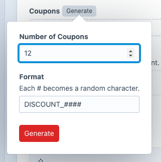
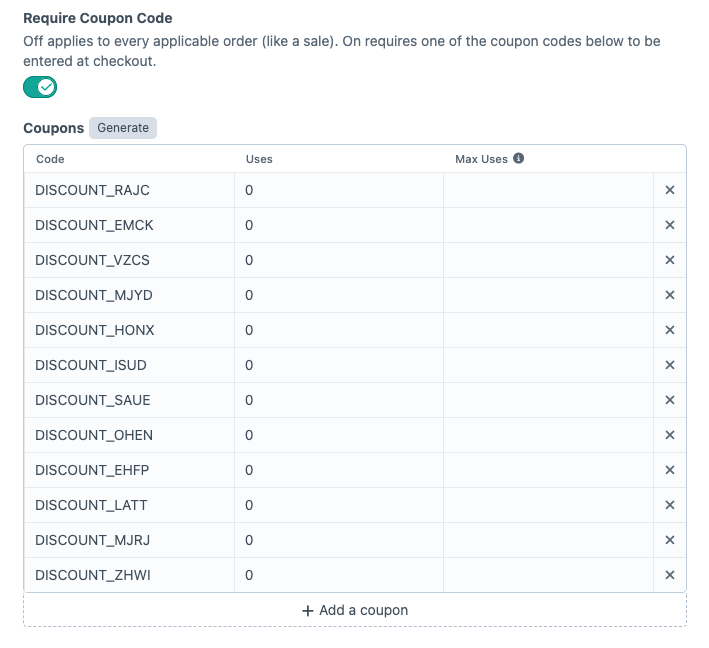

# Advanced Discounts

Bring more power to your discounts and sales.
Easily set up Buy X, Get Y type discounts.

## Requirements

This plugin requires;
- Craft CMS 5.0 or later
- Commerce 5.0 or later

## Setup

### Installation

To install the plugin, search for “Advanced Discounts” in the Craft Plugin Store follow these instructions.

Or install via your terminal.

1. Open your terminal and go to your Craft project:

        cd /path/to/project

2. Then tell Composer to require the plugin, and Craft to install it:

        composer require fostercommerce/advanced-discounts && php craft install/plugin bestsellers

## Getting Started
Access the Advanced Discounts setting page by clicking "Advanced Discounts" in the Control Panel sidebar.

## Plugin Settings
Access the plugin settings from the Control Panel->Settings and clicking on Advanced Discounts

From here you can adjust how tax is applied to an order.
"After discounts" - tax will be applied to the total after the discounts have been calculated.
"Before discounts" - tax will be applied first and then discounts applied to the total including tax.

## Discounts

This is the place for creating and managing all of your discounts. The list is searchable and sortable.

You can configure different types of discount and build out rules for when they will be applied and what happens when those rules are met.

Each Discount has its own sets of Conditions and you can create multiple sets of Conditions with each set triggering different Actions. For example, you may wish to create a multi-tiered Sale where the customer gets a different amount off their order depending on how much they spend - 10% off if they spend \$100, 15% off if they spend \$200, and 20% off when they spend \$500. You can create all of these within the same Discount.

Each tier can also have its own Messages that will be displayed to the customer when the matching criteria are met. Each Message has its very own conditions, allowing you to define multiple Messages per tier. For example, you could show the customer that they have qualified for 10% off and another to show far they are from reaching the 15% discount.

## Creating a Discount
To create a new discount click the "New Discount" button on the to right of the Discounts list page.

### Discount Name
Give your discount a name, this will be shown in the cart when the customer has the discount applied.

### Coupon Codes
If you want to only apply the discount when the customer enters a coupon code, switch that on and add the code or codes that you wish to use.

If you need to create a number of random codes for the same discount then click the "Generate" button

Enter the number of coupons you would like and the format for the codes. Any "#" characters will be replaced by random letters and numbers. When you are ready, click "Generate" and the codes will be created.

Next to each code you are able to see the number of times that the code has been used. Whenever a code is used this number is incremented. You can set a maximum number of times that each code can be used too. If set then the code will no longer work once the maximum uses is reached.

### Discount Type

#### Advanced
This is the core for most Discounts and the one you will 

#### Buy X, Get Y
Should you need to create a "Buy One Get One Free" type promotion then this is what you need.

Set which product or combination of products will trigger the promotion then set which products get discounted when they are added to the cart.

### Conditions
Conditions determine when your discount will be applied to the customer's cart. 

There are two types of conditions, "Global Conditions" and "Cart Conditions". A discount can have multiple sets of "Cart Conditions" which can each trigger different "Cart Actions" but only one set of "Global Conditions". 

#### Global Conditions
Global Conditions allow you to set rules that will apply over and above any individual cart rules. For example, you may wish to only have the discount active during the first week of August.

Choose from the following Condition Sets:

##### Date Range
Criteria based on the date.

##### Line Items
Criteria based on the Order Line Items.

##### Order
Criteria based on the Order totals.

##### User
Criteria based on the User.

Global Conditions are optional and multiple Sets can be defined if you wish. So you can be sure that your discount will only ever be applied when you want it to be.

### Cart Conditions
Cart Conditions are applied only if the Global Conditions for the discount have been met.

You can create multiple groups of Cart Conditions with each group having its own Cart Actions.

## Discount Panels

## Cart Conditions

## Cart Actions

## Promotional Messages

## Coupon Codes

## Excluded Products
