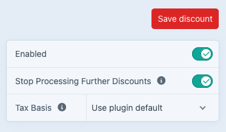
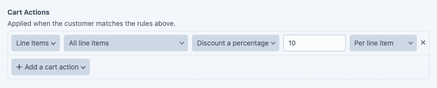
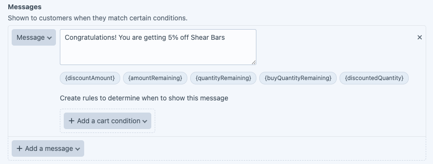
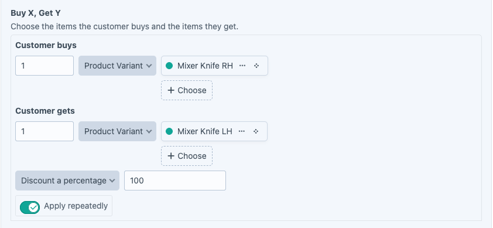
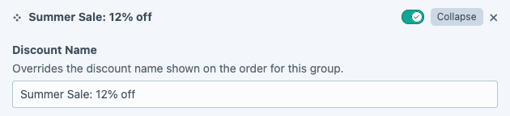
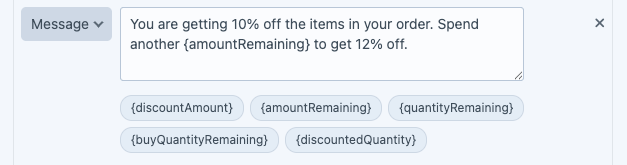
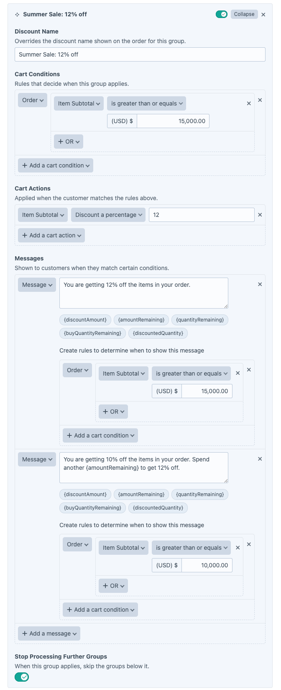
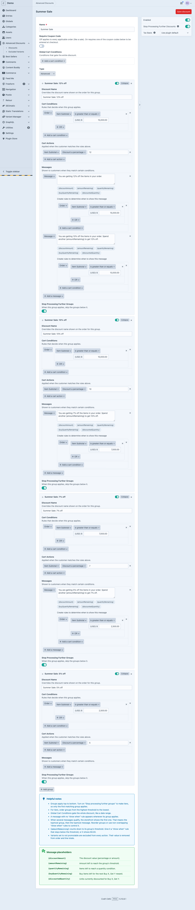

# Examples

## Coupon to get 10% off all products
Goal: Create a coupon that gives 10% off all products.

Go to Advanced Discounts -> Discounts and create a new Discount.

First, give your Discount a name, say "Site-wide coupon".

We only want the discount to be applied if the customer enters a coupon code. We are only publishing one code that anyone can use. So let's turn on "Require Coupon Code".

Click "Add a coupon" and enter the code we want to use in the Code field. Let's say it's going to be BIG10 and it has unlimited uses.

We don't want to allow any other discounts to be applied if the customer has entered this coupon code. So let's turn on "Stop Processing Further Discounts". You can find this on the top right of the screen.

We don't need to apply any restrictions to the sale, so we can also ignore the Global Cart Conditions.

Next, select the type of Discount that will be applied. In this case it is "Advanced", which is the default.

Now we can set up the rules and actions.
First, give the Discount a name - this will be shown in the checkout when the coupon has been applied.

There are no special conditions to be applied, other than the coupon code being entered. So skip past the Cart Conditions and head right to Cart Actions.

We want to provide a 10% discount to all items in the customer's cart. So in Cart Actions, select "Line Items". 

We then have the option to choose which items get the discount. In our case it is all of them, so leave that set to "All line items".

We want to apply a discount of 10% of the item's price, so select "Discount a percentage" and enter 10. Then leave the last setting as "Per line item".

There is no need to show any other message in the cart and checkout. The customer will see that they have the coupon applied. We can skip the Messages section.

Here's what the finished setup should look like.

Once done, click on "Save Discount" to return to the list of configured Advanced Discounts.

Since we don't want to allow any other discounts to be applied, make sure that this discount is at the top of the list so it will be processed first.

Now during checkout your customer can enter the code "BIG10" and they will receive 10% off the cost of items in their order.

## Discounting a few specific products for a week

Assume that you want to provide a discount for a group of products to encourage sales. No coupon code is required. Anybody purchasing those items will get them at a 5% discounted price, and you want to run the promotion for a week starting on Monday. Using Advanced Discounts, you are able to configure a discount to do just this.

Start by creating a new discount and give it a name. For the purposes of this demonstration, we shall call it "Shear Bar Week".

You want the discount to run from August 1 to August 8, so set the Global Cart Conditions appropriately.

In the discount group, add a name, "5% off all Shear Bars".

Set up the Cart Conditions. In this case we want to define some products that will qualify for the discount. So select "Line Items", then click "OR" to show the options available and choose "Has Purchasable".

Now we can choose which products will get the discount. Click "Choose" and select a product you want to include.
You have the option to also specify a quantity, so if you only wanted to apply the discount if someone purchased 2 or more of that item, you can set it here.

If you want to include more than one product, click "OR" and select another product.

*Scope for improvement here, allow the user to select more than 1 product in the same "has purchasable" condition*

Keep going until you have added all the products included in the discount.

Moving on to the Cart Actions, select "Line Items", "Same line items as cart conditions", "Discount a percentage", and set it to 5.

To let the customer know they are getting the discount, add a Message.

## Buy One, Get One Free
When a customer purchases a product, we want to give them another product for free. In our case we want to give a 100% discount on a Left hand mixer knife when purchasing a Right hand mixer knife.

Create a new discount, give it a name, and set the Type to "Buy X, Get Y".

We want to allow customers to get further discounts, so we can leave "Stop Processing Further Discounts" set to "off".

In the panel, give the group a name.

Next, choose the product that will trigger this discount.

Then choose the product that will be discounted.

Set the discount percentage, in our case 100% since we want it to be a free item.

We want to offer this discount for every RH Mixer knife. If the customer buys 4, then they get 4 Left hand mixer knives at the discounted price.

Add any messages you wish to show to the customer when they qualify for the discount.

## Tiered sale

Imagine you want to run a Sale through July and August that gives varying tiers of discount depending on how much the customer has in their cart. For example,

- If they spend $2500 they get 5% discount
- If they spend $7000 they get 7% discount
- If they spend $10000 they get a 10% discount
- If they spend $15000 they get a 12% discount
  
This is possible by setting up multiple groups within your discount. Each group can have its own conditions, actions, and messaging.

Start by creating a new discount and calling it "Summer Sale".

We want the sale to run through July and August, so set the Global Cart Condition accordingly.

Next, set the Type to Advanced.

Set up the Groups. Note that groups are processed first to last, so in order to create this multi-tier sale, we want to start with the top tier and work down to the minimum discount. If any of the group conditions match then we stop processing the remaining groups.

Our first group will be for the 12% discount. Set a title for the group to reflect the level of discount.

Set the Cart Conditions that will match this tier and trigger its Actions. If the customer's cart value is $15000 or more, then they match this group.

When they match, give the customer 12% off their cart value.

We want to let the customer know that they have qualified for the 12% discount, so set up some messaging in the group.

The qualifying message is straightforward enough, but what if we also want to show the customer a message showing how far they are from attaining the discount? No problem, let's create a second message in the same group.

This time, we will make use of the placeholder tokens to dynamically insert information into the message.

Note that the message is showing that the customer has reached the 10% discount and how far they are from reaching 12%.
Let's set some rules for this message that will trigger its display. We want to show it if the customer has $10000 or more in their cart.

You can add as many messages as you like in the group.

We want to stop processing groups in this discount if this group is applied, so turn on "Stop processing further groups".

The entire group should now look like this.

We can now set up additional groups within this discount to apply the conditions, actions, and messages for the remaining tiers.

When done, the whole thing looks like this.

