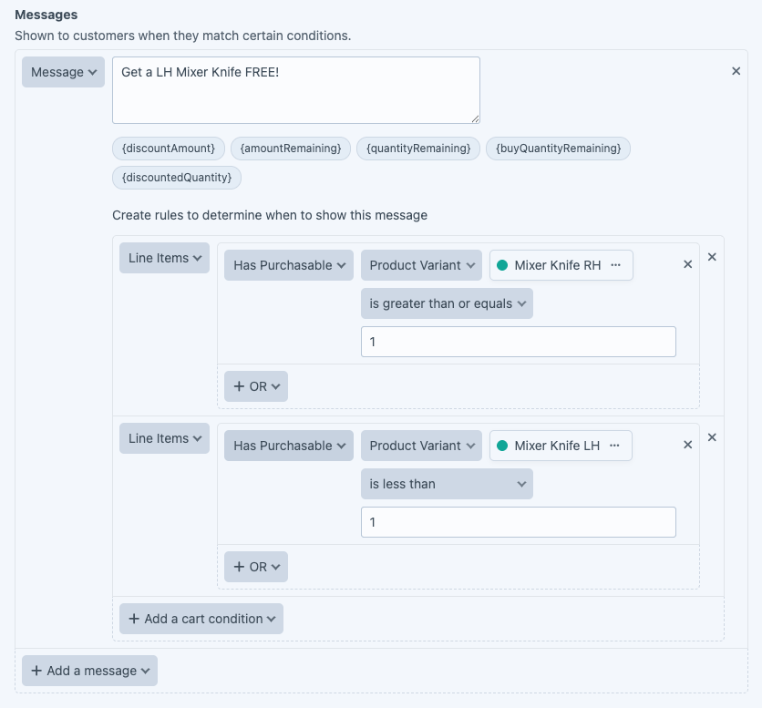

# Recipe: buy one, get one free

When a customer purchases a product, we want to give them another product for free. In our case we want to give a 100% discount on a Left hand mixer knife when purchasing a Right hand mixer knife.

Create a new discount, give it a name, and set the Type to "Buy X, Get Y".

We want to allow customers to get further discounts, so we can leave "Stop Processing Further Discounts" set to "off".

In the panel, give the group a name.

Next, choose the product that will trigger this discount.

Then choose the product that will be discounted.

Set the discount percentage, in our case 100% since we want it to be a free item.

We want to offer this discount for every RH Mixer knife. If the customer buys 4, then they get 4 Left hand mixer knives at the discounted price.

Add any messages you wish to show to the customer when they qualify for the discount.

