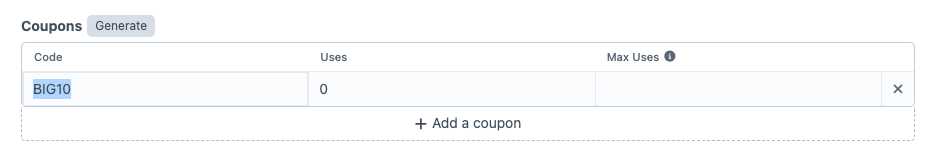
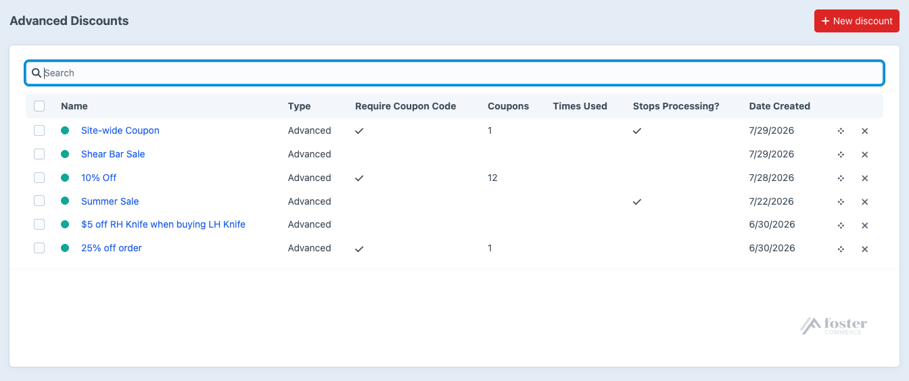

# Recipe: coupon to get 10% off all products

Goal: Create a coupon that gives 10% off all products.

Go to **Advanced Discounts -> Discounts** and create a new Discount.

First, give your Discount a name, say "Site-wide coupon".

We only want the discount to be applied if the customer enters a coupon code. We are only publishing one code that anyone can use. So let's turn on "Require Coupon Code".

Click "Add a coupon" and enter the code we want to use in the Code field. Let's say it's going to be BIG10 and it has unlimited uses.

We don't want to allow any other discounts to be applied if the customer has entered this coupon code. So let's turn on "Stop Processing Further Discounts". You can find this on the top right of the screen.

We don't need to apply any restrictions to the sale, so we can also ignore the Global Cart Conditions.

Next, select the type of Discount that will be applied. In this case it is "Advanced", which is the default.

Now we can set up the rules and actions.
First, give the Discount a name, this will be shown in the checkout when the coupon has been applied.

There are no special conditions to be applied, other than the coupon code being entered. So skip past the Cart Conditions and head right to Cart Actions.

We want to provide a 10% discount to all items in the customer's cart. So in Cart Actions, select "Line Items".

We then have the option to choose which items get the discount. In our case it is all of them, so leave that set to "All line items".

We want to apply a discount of 10% of the item's price, so select "Discount a percentage" and enter 10. Then leave the last setting as "Per line item".

There is no need to show any other message in the cart and checkout. The customer will see that they have the coupon applied. We can skip the Messages section.

Here's what the finished setup should look like.

Once done, click on "Save Discount" to return to the list of configured Advanced Discounts.

Since we don't want to allow any other discounts to be applied, make sure that this discount is at the top of the list so it will be processed first.

Now during checkout your customer can enter the code "BIG10" and they will receive 10% off the cost of items in their order.
