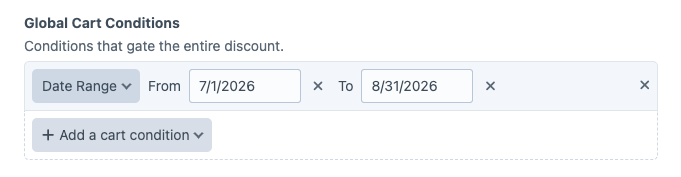
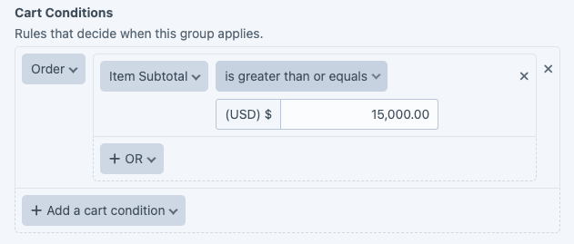
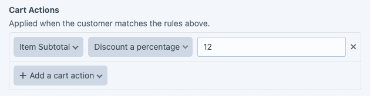
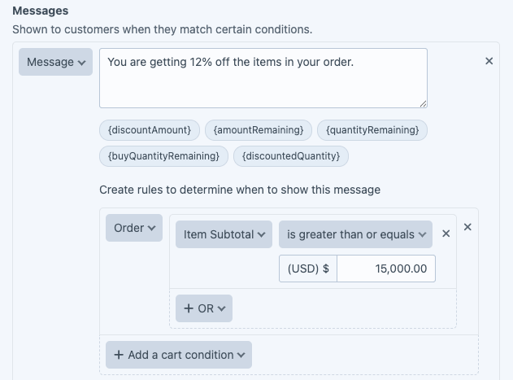
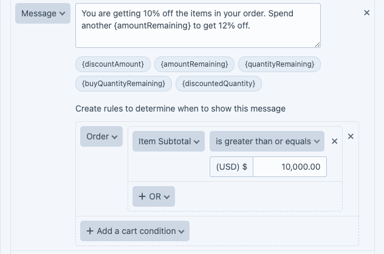

# Recipe: tiered sale

Goal: a sale running through July and August where the discount grows with the cart value.

- Spend \$2,500, get 5% off
- Spend \$7,000, get 7% off
- Spend \$10,000, get 10% off
- Spend \$15,000, get 12% off

Each tier is one group inside a single discount, with its own conditions, actions, and messages.

Create a new discount and name it "Summer Sale".

Set a Global Cart Condition covering July and August.

Set Type to **Advanced**.

Groups are processed top to bottom, and each tier stops the ones below it, so build the highest tier first and work down.

Start with the 12% tier. Give the group a Discount Name that names the tier.

Set the Cart Conditions for the tier: an item subtotal of \$15,000 or more.

Add a Cart Action giving 12% off.

Add a message telling the customer they have qualified for 12% off.

Add a second message in the same group to show how far the customer is from the tier. Use the placeholder tokens to fill in the live figures. See [Messages](../user-guide/messages.md#tokens) for the full list.

Give that second message its own show-when rule so it only appears below the threshold: an item subtotal of \$10,000 or more.

A group takes as many messages as you need.

Turn on **Stop Processing Further Groups** so a cart that reaches this tier does not also pick up the lower ones.

Add a group per remaining tier, in descending order.

## Where to go next

- [Messages](../user-guide/messages.md), the full token list and how show-when rules work.
- [Displaying promotional messages](../dev-guide/displaying-messages.md), rendering the messages on the storefront.
