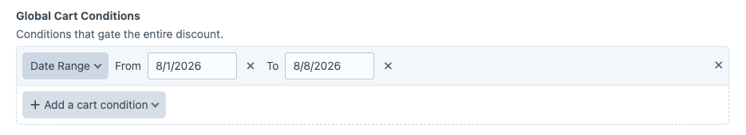
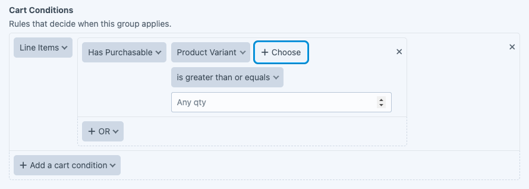
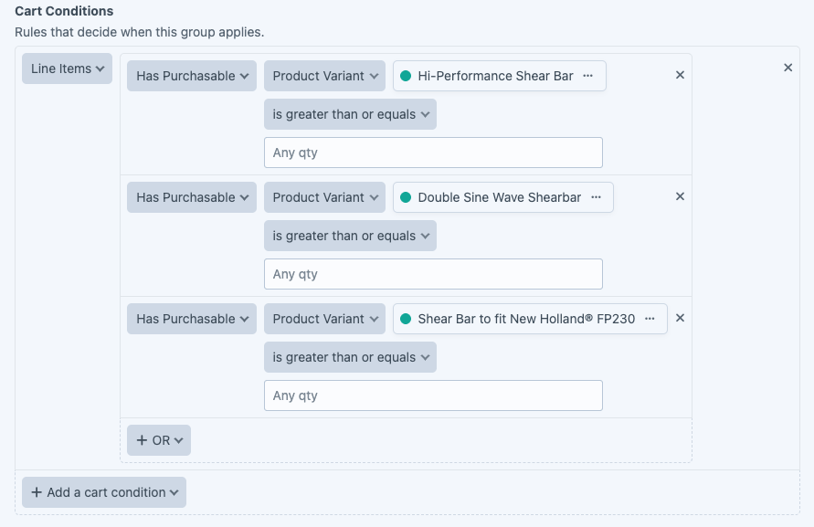

# Recipe: discounting a few specific products for a week

Goal: 5% off a chosen set of products for one week, no coupon code needed.

Create a new discount and name it "Shear Bar Week".

Set the Global Cart Conditions to a **Date Range** covering the week. The end date is inclusive, so August 1 to August 7 runs the full seven days.

Give the group a Discount Name, "5% off all Shear Bars".

In Cart Conditions, add **Line Items**, then click **OR** and choose **Has Purchasable**.

Click **Choose** and pick a product. You can also set a quantity, so the discount only applies once the customer has, say, 2 or more of that item in the cart.

Click **OR** and pick another product for each one you want to include.

In Cart Actions, add **Line Items**, set **Apply to** to **Same line items as cart conditions**, choose **Discount a percentage**, and enter 5. That way the action follows whatever the conditions matched, and you do not name the same products twice.

Add a Message so the customer sees the discount in the cart.

## Where to go next

- [Cart Conditions](../user-guide/cart-conditions.md), the full set of condition rules.
- [Excluded Variants](../user-guide/excluded-variants.md), why a selected product might not be discounted.
