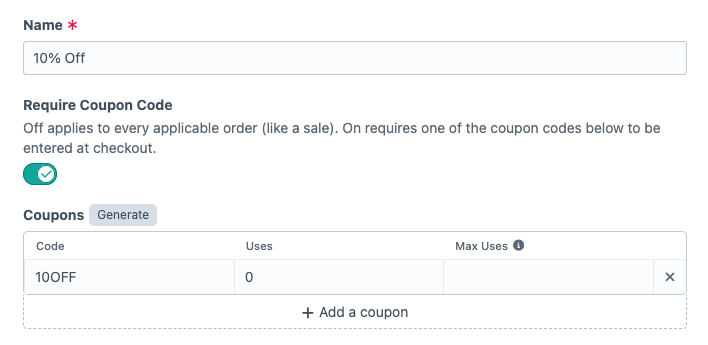

# Coupon Codes

**Require Coupon Code** decides how a discount is triggered. Off, it applies to every order matching its rules, like a sale. On, the customer has to enter one of its codes at checkout.

## Adding codes

Add codes by hand, or click **Generate** for a batch.

Enter how many you want and a format. Each `#` becomes a random character, so `SPRING_####` produces codes like `SPRING_A7K2`. The default format is `DISCOUNT_####`.

Codes are unique across every discount, not just this one. Generated codes avoid codes already in use, and saving a duplicate by hand fails validation. Matching at checkout ignores case, so `BIG10` and `big10` are the same code.

## Uses and limits

**Uses** counts completed orders. It increments when the order completes, so a code sitting in an abandoned cart never counts against its limit.

Leave **Max Uses** blank for unlimited. Once a code reaches its limit it stops working.

## What the customer sees

A code that has hit its limit, or that belongs to a disabled discount, is removed from the cart along with a notice: "This coupon has reached its usage limit." or "This coupon is no longer available." Render `order.notices` in your templates, or the code will vanish with no explanation.

An order holds one coupon code at a time. Entering a second replaces the first.

Commerce's own coupon codes are checked first, so a Commerce discount sharing a code wins.

Deleting a discount deletes its codes.
