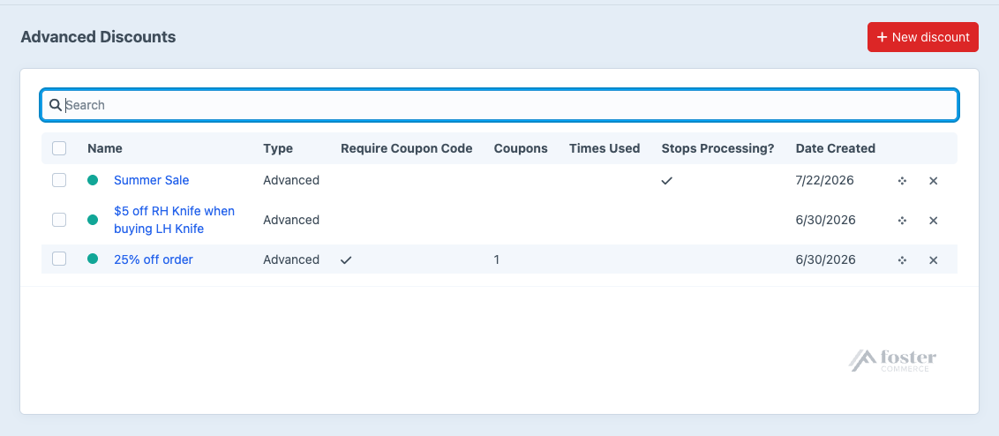
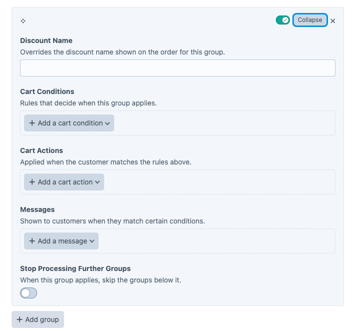
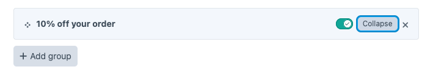

# Discounts

How discounts are created, ordered, and structured. **Advanced Discounts -> Discounts** lists every discount, searchable and sortable.

A discount holds one optional set of Global Conditions and any number of groups. Each group pairs its own cart rules with the actions and messages they trigger, so one discount can carry a whole tiered sale: 10% off at \$100, 15% at \$200, 20% at \$500.

## Creating a discount

Click **New discount** at the top right of the index.

Order matters. Discounts run top down. Drag to reorder on the index.

### Discount Name

Shown in the cart when the discount applies.

### Coupon Codes

Turn on **Require Coupon Code** to gate the discount behind a code. See [Coupon Codes](coupons.md).

### Discount Type

**Advanced** covers standard sales and promotions.

**Buy X, Get Y** covers "buy one, get one free" style offers. Set which product or combination of products triggers the promotion, then which products get discounted.

### Tax Basis

Whether tax is calculated before or after the discount comes off. Defaults to **Use plugin default**. See [Installation](../installation.md#configure).

### Stop Processing Further Discounts

When this discount matches and applies, no discount below it is evaluated.

## Conditions

Conditions decide when a discount applies to the cart. There are two kinds: Global Conditions, and the [Cart Conditions](cart-conditions.md) inside each group.

### Global Conditions

Global Conditions gate the whole discount, whatever its groups say. A date range covering the first week of August is the typical case.

Choose from:

- **Date Range**. Criteria based on the date.
- **Line Items**. Criteria based on the order's line items.
- **Order**. Criteria based on the order totals.
- **User**. Criteria based on the order's customer.

They are optional, and you can define more than one.

### Cart Conditions

Cart Conditions are evaluated only once the Global Conditions have been met. See [Cart Conditions](cart-conditions.md) for the rules on offer and how they combine.

## Discount groups

Click **+ Add group** below the last group to add another.

**Discount Name** on the group overrides the discount's own name on the order when this group applies.

[Cart Conditions](cart-conditions.md) set the rules.

[Cart Actions](cart-actions.md) define what happens when those rules match.

[Messages](messages.md) tell the customer they are close to, or have reached, the threshold.

**Stop Processing Further Groups** skips every group below this one once this group applies.

### Group controls

Every group has a bar across the top holding its controls: the actions menu on the right, and a handle for dragging the group to a new position.

- **Collapse** and **Expand** hide and show the group's body, which keeps a discount with several tiers readable. Double-clicking the bar does the same.
- **Disable** takes the group out of the discount: it produces no discount and no messages, whatever its conditions say. Disabling collapses the group and marks it with a gray dot. **Enable** brings it back.
- **Move up** and **Move down** reorder groups without dragging. Order decides which group wins when **Stop Processing Further Groups** is on.
- **Delete** removes the group from the screen. It leaves the discount when you save.

